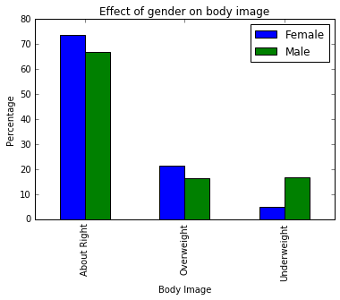

# Studies Involving Two Variables
In most studies involving two variables, each of the variables has a role.
* the explanatory variable (aka independent variable) -- the variable that claims to explain, predict or affect the response
* the response variable (aka dependent variable) -- the outcome of the study.

Typically the explanatory (or independent) variable is denoted by X, while the response (or dependent) variable is denoted by Y.

## Which is which?
The first step should be classifying the two relevant variables according to their role (Explanatory or Response) and type (Quantitative or Categorical).  

Having classified them according to role and type, we can determine what statistical tools should be used to analyze them.

Sometimes the role classification of variables is not clear: an example is a study that explores the relationship between students' SAT Math and SAT Verbal scores. In cases like this, any classification choice would be fine (as long as it is consistent throughout the analysis).

## Causation

* **Association does not imply causation! This idea seems like it will have far-reaching implications for practicing machine learning.**
* A lurking variable is a variable that was not included in your analysis, but that could substantially change your interpretation of the data if it were included.  
* Thus, a relationship between two variables A & B doesn't _necessarily_ mean that A causes B.

## Determining statistical tools

There are four possible Explanatory→Response relationships:
|Explanatory↓ Response→|Categorical|Quantitative|
|:-:|:-:|:-:|
|**Categorical**|C→C|C→Q|
|**Quantitative**|Q→C|Q→Q|

Q→C is not discussed in the elementary statistics course I am studying. Statistical tools for the other three are listed below.

|Relationship|Display|Numerical|Notion|
|:-|:-:|:-:|:-:|
|C→C|Two-way Table and/or Double Bar Chart|Conditional Percentages| Compare distributions of the categorical response variable for each category of the explanatory variable|
|C→Q|Side-by-side Box Plot|Descriptive statistics (Mean + STD or 5-number summary depending on distribution) | Compare distributions of quantitative response variable for each category of the explanatory variable|
|Q→Q|Scatter Plot |**Only for linear relationship** correlation coefficient r; Least squares regression (LSR) line; beware extrapolation | Describe overall pattern (direction, form, strength) and deviations (outliers); including labeled third variable in scatter plot sometimes yields deeper insight into relationship |

### C→C
To summarize the relationship between two categorical variables, we create a display called a **two-way (aka contingency) table**.
The Total row or column is a summary of one of the two categorical variables, ignoring the other.

For example, to let's say we want to analyze how the explanatory variable Gender affects the response variable Body Image. Here's the two-way table:

||About Right|Overweight|Underweight|Total|
|:-:|:-:|:-:|:-:|:-:|
|**Female**|560|163|37|760|
|**Male**|295|72|73|440|
|**Total**|855|235|110|1200|

Our **goal is to examine the distributions of the response variable (body image) across the different values of the explanatory variable (gender)**. We will
* create a table of **conditional percentages** by "conditioning" on each of the values of the explanatory single categorical variable
* Convert the numerical data of the explanatory variable into percentages along the response variable axis.
Here's the table of conditional percentages:

||About Right|Overweight|Underweight|Total|
|:-:|:-:|:-:|:-:|:-:|
|**Female**|560/760 = 73.7%|163/760 = 21.5%|37/760 = 4.9%|760/760 = 100%|
|**Male**|295/440 = 67%|72/440 = 16.4%|73/440 = 16.6%|440/440 = 100%|

Conditional percentages are calculated for each value of the explanatory variable separately. They can be row percents, if the explanatory variable "sits" in the rows (as above), or column percents, if the explanatory variable "sits" in the columns. We look at how the pattern of conditional percentages differs between the values of the explanatory variable.

_Note: it's also possible to find percentages of the whole, where only the bottom-right square in the two-way table will necessarily be equal to 100%, but this is different._

#### Double Bar Chart

We can also use a **double-bar chart** to visualize the table of conditional percentages. The bar chart will have the response variable along the x-axis separated into the explanatory variable as the "double-bars."

The explanatory variable 
* sums to 100%
* appears in legend of bar plot
* "explains" each of the values of the response variable

### Q→Q

To summarize the relationship between two quantitative variables, we create a **scatter plot**. We plot corresponding values of the explanatory and response variables along the X- and Y-axes respectively. We describe
* the overall pattern of the plot and
  * direction: positive or negative
  * form: which model fits, e.g. linear, curvilinear, clustered, etc.
  * strength: how closely do the data points follow the form? For linear relationships use correlation r to quantify.
* deviations from the pattern.
  * outliers

#### Linear Relationships

##### Correlation
If and only if a scatter plot suggests a linear relationship, we supplement it with the correlation coefficient (r). The correlation (r)
* measures the strength and direction of a linear relationship between two quantitative variables
* is **sensitive to outliers** and we might consider supplying it both with and without outliers
* ranges between -1 and 1:

|Range|Indication|
|:-:|:-:|
|Near -1|Strong negative linear relationship|
|Near 0|Weak linear relationship|
|Near 1|Strong positive linear relationship|

##### Linear Regression
A straight line simply adequately summarizes a linear relationship. The most commonly used criterion for finding this line is "least squares" by finding has the smallest sum of squared vertical deviations of the data points from a line.   

* The least squares regression line predicts the value of the response variable for a given value of the explanatory variable. 
* The slope of the least squares regression line can be interpreted as the average change in the response variable when the explanatory variable increases by 1 unit.
* Since there is no way of knowing whether a relationship holds beyond the range of the explanatory variable in the data, **extrapolation** (prediction of values of the explanatory variable that fall outside the range of the data) **is not reliable**, and should be avoided.
